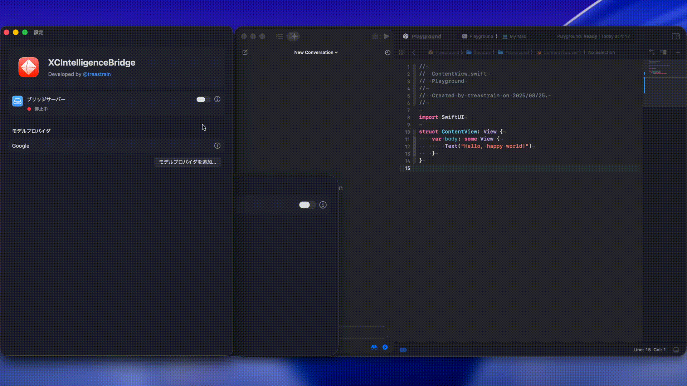

# XCIntelligenceBridge

Bridging Xcode's coding intelligence features to various model providers.

> [!WARNING]
> This project is currently in active development with breaking changes.
>
> このプロジェクトは現在、破壊的変更を含む開発中です。

> [!NOTE]
> At the moment I'm not accepting contributions to the repository.
> Feedback for XCIntelligenceBridge can be sent to @treastrain on social networks.
> Thank you.
>
> このリポジトリは、現時点ではコントリビュートを受け付けておりません。フィードバックは SNS で @treastrain へお寄せください。

## Quick Start

### with Google Gemini

1.  Download and install the [latest release](https://github.com/treastrain/XCIntelligenceBridge/releases).
2.  Open XCIntelligenceBridge, click "モデルプロバイダを追加…", and select "Google Gemini".
3.  Enter your Google Gemini API key, which you can obtain from sources like [https://aistudio.google.com/apikey](https://aistudio.google.com/apikey).
4.  Click the details icon button next to the "ブリッジサーバー" toggle switch to check the port number.
5.  Open Xcode 26 on macOS Tahoe, go to Settings > Intelligence, click "Add a Model Provider…", and select "Locally Hosted".
6.  Enter the port number you just confirmed into the "Port" field, type a description like "XCIntelligenceBridge" in the "Description" field, and add it.
7.  Try out Xcode's coding intelligence features with Google Gemini!

> [!NOTE]
> The API key you enter there is stored in your macOS Keychain.

## Support Model Providers

- Google Gemini

## Kanban

https://github.com/treastrain/XCIntelligenceBridge/projects

## Requirements

- macOS 26+
- Xcode 26+

## License

Apache License 2.0
